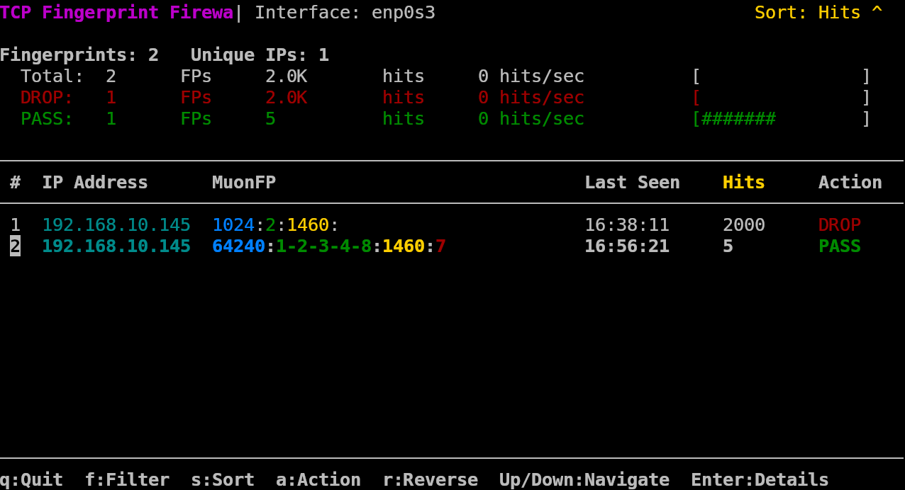

# TCP Fingerprint Monitor

A visualization and monitoring tool for TCP fingerprints detected by the TCP Fingerprint Firewall.

## Contributing

We welcome contributions to TCP Fingerprint Firewall! Please see the [CONTRIBUTING.md](CONTRIBUTING.md) file for guidelines on how to contribute.



## Features

- **Real-time Monitoring**: Updates every second to show the latest fingerprint activity
- **htop-like Interface**: Familiar, intuitive interface with color-coding and navigation
- **Interactive Filtering**: Filter by IP, fingerprint pattern, or action
- **Flexible Sorting**: Sort by timestamp, hit count, or IP address
- **Hit Rate Tracking**: See packets per second for each fingerprint
- **Summary Statistics**: Quick overview of DROP vs PASS activity
- **Detailed View**: Drill down to see full details about any fingerprint
- **Visual Indicators**: Progress bars show activity levels at a glance

## Requirements

- ncurses library
- Running TCP Fingerprint Firewall

## Installation

The monitor is built automatically when you build the main firewall:

```bash
make
```

Or you can build just the monitor:

```bash
make monitor
```

To install system-wide:

```bash
sudo make install
```

## Usage

```bash
tcp-monitor <interface>
```

Where `<interface>` is the network interface where the TCP Fingerprint Firewall is running.

## Interactive Controls

| Key       | Action                                      |
|-----------|---------------------------------------------|
| ↑/↓       | Navigate through fingerprint entries        |
| PgUp/PgDn | Navigate by page                            |
| Enter     | View detailed information for entry         |
| f         | Filter by IP address or fingerprint pattern |
| s         | Change sort field (Time/Hits/IP)            |
| r         | Reverse sort order                          |
| a         | Toggle actions (PASS/DROP/Both)             |
| q         | Quit the monitor                            |

## Understanding the Display

### Summary Area

The top section shows summary statistics:

- Total fingerprints and unique IPs
- Counts for PASS and DROP fingerprints
- Hit counts with formatted numbers (K, M, G suffixes)
- Hit rates (packets per second)
- Visual bars showing DROP vs PASS proportions

### Fingerprint Table

The main table shows individual fingerprint entries with:

- Color-coded IP addresses
- Fingerprint components with distinct colors:
  - **Blue**: Window Size
  - **Green**: TCP Options
  - **Yellow**: MSS (Maximum Segment Size)
  - **Red**: Window Scale
- Last seen timestamp
- Hit count with current rate (packets per second)
- Action (DROP/PASS) with color coding

### Details View

Pressing Enter on a selected entry shows detailed information:

- Full fingerprint pattern with color coding
- Matched rule that triggered the action
- Statistics (total hits, rate)
- Last seen timestamp in full format
- Raw TCP data (window size, options bitmap, MSS, window scale)

## Troubleshooting

- **"Failed to access maps"**: The TCP Fingerprint Firewall must be running
- **Terminal display issues**: Ensure your terminal supports ncurses and colors
- **Small terminal warning**: Resize your terminal to at least 80x15 characters

## Performance Considerations

The monitor has minimal performance impact and can run continuously. It reads data directly from the BPF maps without affecting the firewall's operation.


## License

This software is dual-licensed under:
- [GNU Affero General Public License v3.0](https://www.gnu.org/licenses/agpl-3.0.en.html) (AGPLv3) - for those willing to comply with AGPLv3 terms including source code release requirements
- Proprietary license - for those who cannot or do not want to adhere to AGPLv3 terms

If you do not want to be bound by the AGPLv3 terms (such as releasing source code for modifications or network usage), you must acquire a proprietary license.

For details, see the LICENSE file.

## See Also

- [README](README.md) - Overview and quick start guide
- [User Manual](user-manual.md) - Complete usage documentation
- [Fingerprint Format](fingerprint-format.md) - Details on TCP fingerprint patterns
- [USAGE](USAGE.md) - Quick reference guide
- [Troubleshooting Guide](troubleshooting.md) - Solutions for common issues
