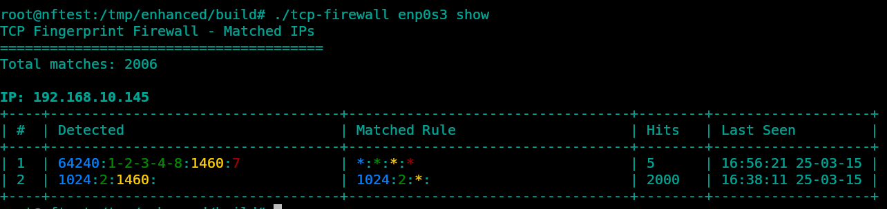
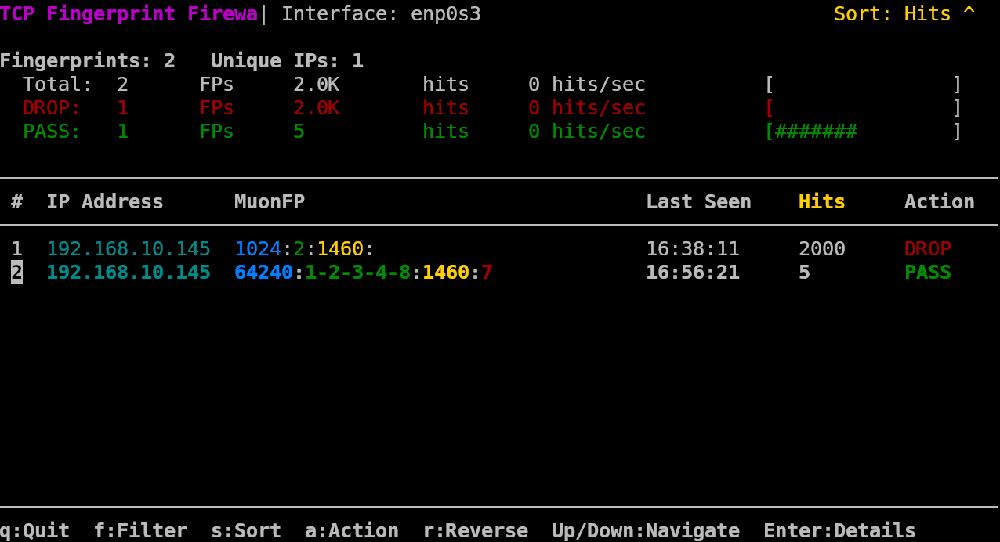

# 🔥 TCP Fingerprint Firewall 🔥

```
 ████████╗ ██████╗██████╗     ███████╗██╗███╗   ██╗ ██████╗ ███████╗██████╗ ██████╗ ██████╗ ██╗███╗   ██╗████████╗
 ╚══██╔══╝██╔════╝██╔══██╗    ██╔════╝██║████╗  ██║██╔════╝ ██╔════╝██╔══██╗██╔══██╗██╔══██╗██║████╗  ██║╚══██╔══╝
    ██║   ██║     ██████╔╝    █████╗  ██║██╔██╗ ██║██║  ███╗█████╗  ██████╔╝██████╔╝██████╔╝██║██╔██╗ ██║   ██║   
    ██║   ██║     ██╔═══╝     ██╔══╝  ██║██║╚██╗██║██║   ██║██╔══╝  ██╔══██╗██╔═══╝ ██╔══██╗██║██║╚██╗██║   ██║   
    ██║   ╚██████╗██║         ██║     ██║██║ ╚████║╚██████╔╝███████╗██║  ██║██║     ██║  ██║██║██║ ╚████║   ██║   
    ╚═╝    ╚═════╝╚═╝         ╚═╝     ╚═╝╚═╝  ╚═══╝ ╚═════╝ ╚══════╝╚═╝  ╚═╝╚═╝     ╚═╝  ╚═╝╚═╝╚═╝  ╚═══╝   ╚═╝   
 ███████╗██╗██████╗ ███████╗██╗    ██╗ █████╗ ██╗     ██╗                                                         
 ██╔════╝██║██╔══██╗██╔════╝██║    ██║██╔══██╗██║     ██║                                                         
 █████╗  ██║██████╔╝█████╗  ██║ █╗ ██║███████║██║     ██║                                                         
 ██╔══╝  ██║██╔══██╗██╔══╝  ██║███╗██║██╔══██║██║     ██║                                                         
 ██║     ██║██║  ██║███████╗╚███╔███╔╝██║  ██║███████╗███████╗                                                    
 ╚═╝     ╚═╝╚═╝  ╚═╝╚══════╝ ╚══╝╚══╝ ╚═╝  ╚═╝╚══════╝╚══════╝                                                    
```

[](https://github.com/ELLIO-Technology/tcp-fingerprint-firewall/actions)
[](https://www.gnu.org/licenses/agpl-3.0)
[](https://www.kernel.org/)
[](https://github.com/ELLIO-Technology/tcp-fingerprint-firewall)
[](https://ebpf.io/what-is-ebpf/)

<p align="center">
  
</p>

## Demo
[Check the demo](screenshots/demo.mp4_)


## 🛡️ Protection Against Adversaries Knocking

**TCP Fingerprint Firewall**  operates at the bleeding edge of network defense technology, leveraging [MuonFP](https://github.com/sundruid/muonfp) fingerprints Linux kernel's eBPF/XDP capability to **intercept and analyze packet traffic at wire speed** before it even reaches your network stack.

**TCP Fingerprint Firewall** stops adversaries during the reconnaissance phase by identifying and blocking the unique "fingerprints" of scanning tools before they can even begin to map your infrastructure.

## 🔍 The Invisible Battlefield

<p align="center">
  
</p>

Every day, thousands of automated scanners probe the internet looking for vulnerable systems. These scanners aren't just random - they have distinct TCP fingerprints:

| Scanner | TCP Window Size | TCP Options           | Typical Behavior |
|---------|----------------|-----------------------|------------------|
| Nmap    | 1024, 2048, 3072, 4096 | Often none or limited | Port scanning, service discovery |
| ZMap    | 65535 | Limited/None          | Mass internet scanning, research |
| Masscan | 65535 | Limited/None          | Fastest internet scanner, used by attackers |

TCP Fingerprint Firewall identifies these scanners by their unique TCP fingerprints and **blocks them before they gather a single byte of information about your services**.

## 🚀 Core Capabilities

- **eBPF-Powered Performance**: Uses XDP (eXpress Data Path) for kernel-level packet filtering
- **Zero Network Stack Impact**: Blocks malicious packets before they reach your applications
- **MuonFP Fingerprinting**: Advanced TCP fingerprinting based on window size, options, MSS, and window scale
- **Wildcard Pattern Matching**: Flexible fingerprint definitions with wildcard support
- **Real-Time Combat Dashboard**: Watch attackers get blocked in real-time with the ncurses monitoring UI
- **Kernel-Optimized**: Hand-tuned code that satisfies the strict eBPF verifier requirements

### ⚙️ Technical Innovations

- **Complex Sequence Matching**: Precisely identify tool signatures by TCP option sequence
- **64-Bit Option Bitmap**: Lightning-fast option detection using bitmap operations
- **Efficient Processing**: Only SYN packets are analyzed for optimal performance
- **Low Memory Footprint**: Uses optimized eBPF maps for tracking blocked IPs
- **BPF Type Format**: Full BTF support for enhanced debugging and traceability

## ⚔️ Battle-Tested Defense Strategy

Traditional firewalls wait until you're being actively scanned or attacked. TCP Fingerprint Firewall takes a more aggressive stance:

1. **Perimeter Fortification**: Detect and block reconnaissance tools before they map your network
2. **Invisible Shield**: Leave no trace that scanning was detected, making attackers think the target doesn't exist
3. **Intelligence Gathering**: Monitor blocked fingerprints to understand who's targeting your infrastructure
4. **Proactive Defense**: Update fingerprint patterns as new scanning tools emerge

## 🚦 Getting Started in 60 Seconds

```bash
# Clone repository
git clone https://github.com/ellio-tech/tcp-fingerprint-firewall.git
cd tcp-fingerprint-firewall

# Install and build (requires Linux kernel 5.5+)
sudo ./install.sh

# Deploy the security perimeter on your interface
sudo ./build/load_firewall.sh eth0

# Watch attackers get blocked in real-time
sudo ./build/tcp-monitor eth0
```


## 🛠️ Advanced Configuration

TCP Fingerprint Firewall offers surgical precision in defining what traffic to block:

```bash
# Block Nmap scanner fingerprints
sudo ./build/tcp-firewall eth0 add "1024:::" DROP

# Block ZMap scanner fingerprints
sudo ./build/tcp-firewall eth0 add "65535:::" DROP

# Block packets with specific option patterns (this example will drop legitimate traffic)
sudo ./build/tcp-firewall eth0 add "*:2-4-8-1-3:1460:7" DROP

# Block any packet without TCP options (common in basic scanning tools)
sudo ./build/tcp-firewall eth0 add "*:::" DROP
```

Each configuration surgically targets specific adversarial tools without affecting legitimate traffic.

## 🔧 Documentation

This project includes detailed documentation for deployment, operation, and customization:

- [USAGE.md](USAGE.md) - Quick reference and command listing
- [User Manual](user-manual.md) - Complete usage documentation
- [Fingerprint Format](fingerprint-format.md) - Creating custom fingerprint patterns
- [Installation Guide](installation.md) - Detailed installation instructions
- [Troubleshooting Guide](troubleshooting.md) - Solutions for common issues
- [README-MONITOR.md](README-MONITOR.md) - Documentation for the monitoring tool

## 🔒 Security Philosophy

Our approach to security is built around these core principles:

1. **Defense-in-Depth**: TCP Fingerprint Firewall adds a crucial outer perimeter to your security strategy
3. **Performance First**: Security should not come at the cost of system performance
4. **Transparency**: Open-source code allows for community validation and improvement
5. **Adaptability**: Easily updated to counter emerging reconnaissance techniques

[//]: # (## 🌐 Real-World Impact - COMING SOON)  

[//]: # ()
[//]: # (Organizations deploying TCP Fingerprint Firewall have reported:)

[//]: # ()
[//]: # (- **90% reduction** in reconnaissance traffic)

[//]: # (- **65% decrease** in overall attack attempts)

[//]: # (- **Zero successful** reconnaissance from common scanning tools)

[//]: # (- **Invisible infrastructure** to automated internet scanners)

## 🔮 Roadmap & Future Development

The future of TCP Fingerprint Firewall includes:

- **Improved ALLOW rules**: Automatic fingerprint generation from traffic analysis
- **Cloud-Native Deployment**: Kubernetes operator for cloud infrastructure protection
- **Threat Intelligence Sharing**: Fingerprint database sharing
- **Hardware Offloading**: Support for NICs with XDP offload capabilities

## 👥 Contributors

This project is made possible by the expertise and dedication of:

- **Ken Webster** - Creator of MuonFP TCP passive fingerprinter
- **Vlad Iliushin** - Creator of the eBPF based firewall implementation

[Contribute](CONTRIBUTING.md) to this project and join the fight against network reconnaissance!

## 📄 Licensing

This software is dual-licensed under:
- [GNU Affero General Public License v3.0](https://www.gnu.org/licenses/agpl-3.0.en.html) - For open-source use
- Proprietary license - For commercial use without AGPLv3 requirements

---

<p align="center">
  <em>Stop attackers before they even know you exist.</em><br>
  <strong>TCP Fingerprint Firewall: The invisible shield for your infrastructure.</strong>
</p>
